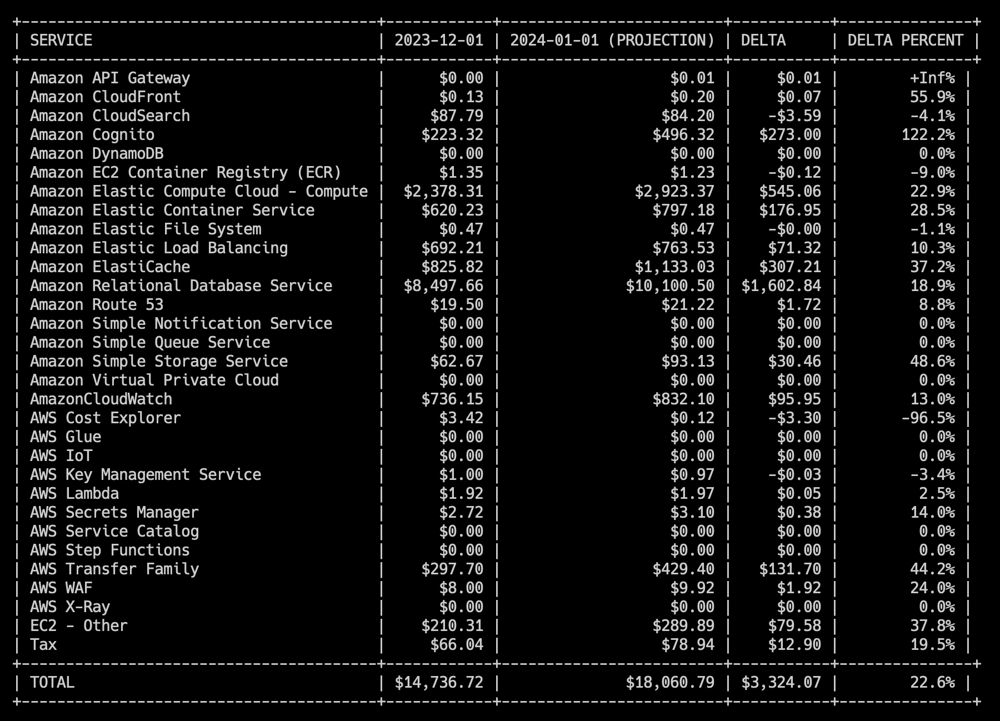
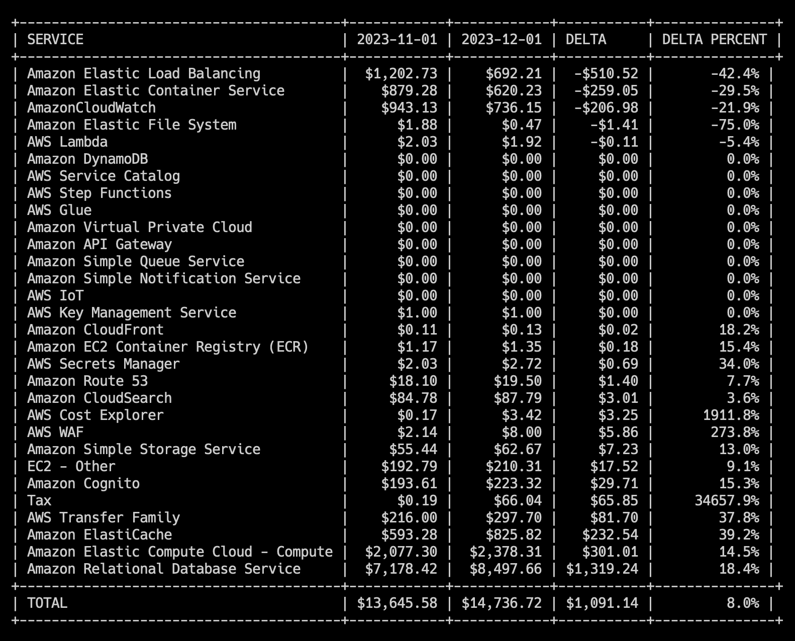
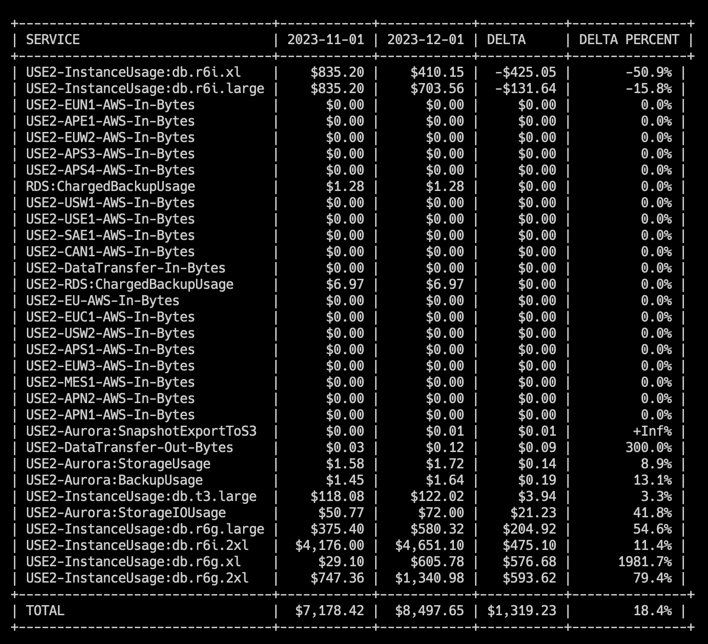

# AWS Cost Comparison Tool

This is a simple CLI tool that wraps the AWS Cost Explorer APIs to be able to quickly identify cost anomalies between monthly bills.

## Use Cases

* Comparing costs between two different months
* Creating a CSV report to show changes in the bill
* Diagnosing which specific line item changed the most to identify cost anomalies

## Installation

### Requirements

* AWS Credentials Setup locally
* Access to Cost Explorer APIs (`ce:*`)

### Homebrew

```bash
brew tap rgoomar/aws-cct https://github.com/rgoomar/aws-cct
brew install aws-cct
```

Updating
```bash
brew upgrade aws-cct
```

### GitHub Releases

Download from the [releases](https://github.com/rgoomar/aws-cct/releases)

### Go Get

```bash
go get github.com/rgoomar/aws-cct
```

## Usage

For full usage, see the help page with `aws-cct --help`:

```
NAME:
   aws-cct - AWS Cost Comparison Tool

USAGE:
   aws-cct [global options] command [command options]

COMMANDS:
   help, h  Shows a list of commands or help for one command

GLOBAL OPTIONS:
   --start value                First month to compare (2020-01-01) (default: "2023-12-01")
   --end value                  Second month to compare (2020-02-01) (default: "2024-01-01")
   --cost-metric value          Cost Metric to compare (NetAmortizedCost, UnblendedCost, etc.) (default: "NetAmortizedCost")
   --service value              Define a service to dig into
   --tag value [ --tag value ]  Tag value to filter results (app=web, env=prod, etc.)
   --sort value                 Column to sort results on (name, start, end, delta, deltapercent) (default: "name")
   --sort-order value           Order to sort in (asc or desc) (default: "asc")
   --output value               Output format (supported formats: table, csv) (default: "table")
   --help, -h                   show help
```

*Basic usage*

This will show estimated projections for the current month.

```bash
aws-cct
```



*Diagnose where the largest cost increase is coming from*

Between November & December 2023:

First, figure out which service has the largest cost
```bash
aws-cct --start 2023-11-01 --end 2023-12-01 --sort delta
```


Then, copy that full service name and dig into which specific line item within that service increased the most.

In this example, the RDS costs are high and we want to see what specifically increased.
```bash
aws-cct --start 2023-11-01 --end 2023-12-01 --sort delta --service "Amazon Relational Database Service"
```



*Dig into EC2 costs*

You can get the string from the initial output. Simply copy the value in the "SERVICE" section and you can filter into that
```bash
aws-cct --service "Amazon Elastic Compute Cloud - Compute"
```

*Filter by tags*

You can get filter costs by tag, to return costs for resources that match all specified tag values.
```bash
aws-cct --tag app=widgetizer --tag env=production
```

*Compare Older Months*
```bash
aws-cct --start 2023-08-01 --end 2023-09-01
```

*Sort on a column*

You can sort on any column, ascending or descending, for example to see the largest deltas first.
```bash
aws-cct --sort delta --sort-order desc
```

*Output in CSV format*

This will output in a CSV friendly format and you can utilize this to do analysis or for reporting.
```bash
aws-cct --output csv
```

## Local Development

Requires Go >= 1.21

### Project Structure
```
.
├── cmd/aws-cct/     # Main application entry point
├── pkg/
│   ├── costexplorer/ # AWS Cost Explorer client
│   ├── display/      # Output formatting
│   └── models/       # Data models
└── build/           # Build artifacts
```

### Available Make Commands

- `make build` - Build the application
- `make test` - Run tests
- `make test-coverage` - Run tests with coverage report
- `make lint` - Run linter
- `make fmt` - Format code
- `make clean` - Clean build artifacts
- `make deps` - Install dependencies

### Getting Started

1. Install dependencies:
   ```bash
   make deps
   ```

2. Build the application:
   ```bash
   make build
   ```

3. Run tests:
   ```bash
   make test
   ```

The binary will be available in the `build` directory.

## License

MIT
